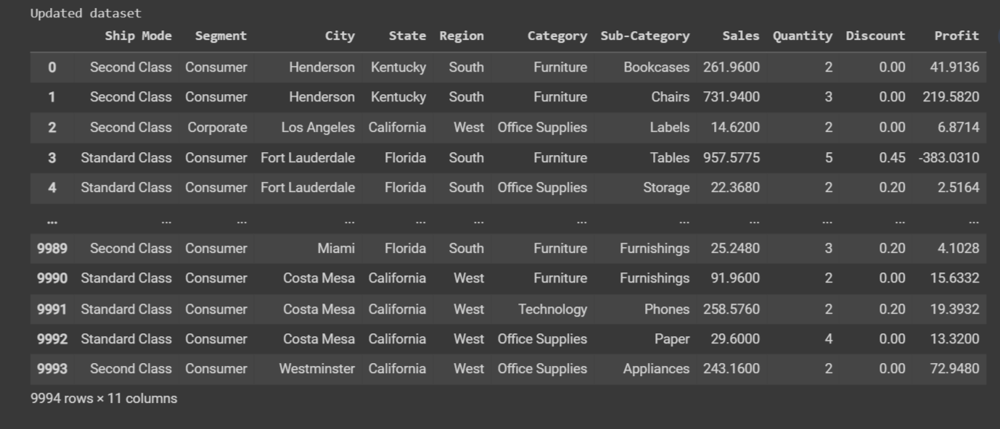
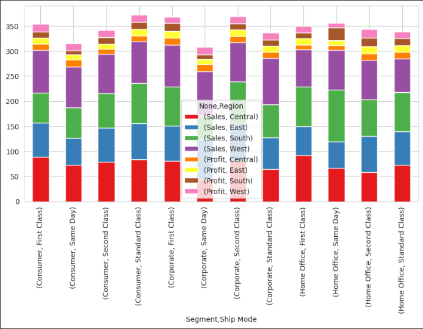

# Ex-08-Data-Visualization-

## AIM
To Perform Data Visualization on the given dataset and save the data to a file. 

# Explanation
Data visualization is the graphical representation of information and data. By using visual elements like charts, graphs, and maps, data visualization tools provide an accessible way to see and understand trends, outliers, and patterns in data.

# ALGORITHM
### STEP 1
Read the given Data
### STEP 2
Clean the Data Set using Data Cleaning Process
### STEP 3
Apply Feature generation and selection techniques to all the features of the data set
### STEP 4
Apply data visualization techniques to identify the patterns of the data.

# CODE

### Data Pre-Processing

```
import pandas as pd
import numpy as np
import matplotlib.pyplot as plt
import seaborn as sns

df=pd.read_csv("Superstore.csv",encoding='unicode_escape')
df

df.head()

df.info()

df.drop('Row ID',axis=1,inplace=True)
df.drop('Order ID',axis=1,inplace=True)
df.drop('Customer ID',axis=1,inplace=True)
df.drop('Customer Name',axis=1,inplace=True)
df.drop('Country',axis=1,inplace=True)
df.drop('Postal Code',axis=1,inplace=True)
df.drop('Product ID',axis=1,inplace=True)
df.drop('Product Name',axis=1,inplace=True)
df.drop('Order Date',axis=1,inplace=True)
df.drop('Ship Date',axis=1,inplace=True)
print("Updated dataset")
df

df.isnull().sum()

plt.figure(figsize=(8,8))
plt.title("Data with outliers")
df.boxplot()
plt.show()

plt.figure(figsize=(8,8))
cols = ['Sales','Quantity','Discount','Profit']
Q1 = df[cols].quantile(0.25)
Q3 = df[cols].quantile(0.75)
IQR = Q3 - Q1
df = df[~((df[cols] < (Q1 - 1.5 * IQR)) |(df[cols] > (Q3 + 1.5 * IQR))).any(axis=1)]
plt.title("Dataset after removing outliers")
df.boxplot()
plt.show()
```
###  Segment With Highest Sales

```
sns.lineplot(x="Segment",y="Sales",data=df,marker='o')
plt.title("Segment vs Sales")
plt.xticks(rotation = 90)
plt.show()

sns.barplot(x="Segment",y="Sales",data=df)
plt.xticks(rotation = 90)
plt.show()
```

###  City with Highest Profit

```
df.shape
df1 = df[(df.Profit >= 60)]
df1.shape

plt.figure(figsize=(30,8))
states=df1.loc[:,["City","Profit"]]
states=states.groupby(by=["City"]).sum().sort_values(by="Profit")
sns.barplot(x=states.index,y="Profit",data=states)
plt.xticks(rotation = 90)
plt.xlabel=("City")
plt.ylabel=("Profit")
plt.show()
```
### Profitable Ship Mode

```
sns.barplot(x="Ship Mode",y="Profit",data=df)
plt.show()

sns.lineplot(x="Ship Mode",y="Profit",data=df)
plt.show()

sns.violinplot(x="Profit",y="Ship Mode",data=df)

sns.pointplot(x=df["Profit"],y=df["Ship Mode"])
```

### Sales Of The Product Based On Region

```
states=df.loc[:,["Region","Sales"]]
states=states.groupby(by=["Region"]).sum().sort_values(by="Sales")
sns.barplot(x=states.index,y="Sales",data=states)
plt.xticks(rotation = 90)
plt.xlabel=("Region")
plt.ylabel=("Sales")
plt.show()

df.groupby(['Region']).sum().plot(kind='pie', y='Sales',figsize=(6,9),pctdistance=1.7,labeldistance=1.2)
```

### Relation Between Sales And Profit

```
df["Sales"].corr(df["Profit"])

df_corr = df.copy()
df_corr = df_corr[["Sales","Profit"]]
df_corr.corr()

sns.pairplot(df_corr, kind="scatter")
plt.show()
```
### Heatmap

```
df4=df.copy()

from sklearn.preprocessing import LabelEncoder,OrdinalEncoder,OneHotEncoder
le=LabelEncoder()
ohe=OneHotEncoder
oe=OrdinalEncoder()

df4["Ship Mode"]=oe.fit_transform(df[["Ship Mode"]])
df4["Segment"]=oe.fit_transform(df[["Segment"]])
df4["City"]=le.fit_transform(df[["City"]])
df4["State"]=le.fit_transform(df[["State"]])
df4['Region'] = oe.fit_transform(df[['Region']])
df4["Category"]=oe.fit_transform(df[["Category"]])
df4["Sub-Category"]=le.fit_transform(df[["Sub-Category"]])

from sklearn.preprocessing import RobustScaler
sc=RobustScaler()
df5=pd.DataFrame(sc.fit_transform(df4),columns=['Ship Mode', 'Segment', 'City', 'State','Region',
                                               'Category','Sub-Category','Sales','Quantity','Discount','Profit'])

plt.subplots(figsize=(12,7))
sns.heatmap(df5.corr(),cmap="PuBu",annot=True)
plt.show()
```
### Relation Between Sales And Profit Based On The Following Category

Segment
```
grouped_data = df.groupby('Segment')[['Sales', 'Profit']].mean()
fig, ax = plt.subplots()
ax.bar(grouped_data.index, grouped_data['Sales'], label='Sales')
ax.bar(grouped_data.index, grouped_data['Profit'], bottom=grouped_data['Sales'], label='Profit')
ax.set_xlabel('Segment')
ax.set_ylabel('Value')
ax.legend()
plt.show()
```

City
```
grouped_data = df.groupby('City')[['Sales', 'Profit']].mean()
fig, ax = plt.subplots()
ax.bar(grouped_data.index, grouped_data['Sales'], label='Sales')
ax.bar(grouped_data.index, grouped_data['Profit'], bottom=grouped_data['Sales'], label='Profit')
ax.set_xlabel('City')
ax.set_ylabel('Value')
ax.legend()
plt.show()
```

States
```
grouped_data = df.groupby('State')[['Sales', 'Profit']].mean()
fig, ax = plt.subplots()
ax.bar(grouped_data.index, grouped_data['Sales'], label='Sales')
ax.bar(grouped_data.index, grouped_data['Profit'], bottom=grouped_data['Sales'], label='Profit')
ax.set_xlabel('State')
ax.set_ylabel('Value')
ax.legend()
plt.show()
```

Segment and Ship Mode
```
grouped_data = df.groupby(['Segment', 'Ship Mode'])[['Sales', 'Profit']].mean()
pivot_data = grouped_data.reset_index().pivot(index='Segment', columns='Ship Mode', values=['Sales', 'Profit'])
fig, ax = plt.subplots()
pivot_data.plot(kind='bar', ax=ax)
ax.set_xlabel('Segment')
ax.set_ylabel('Value')
plt.legend(title='Ship Mode')
plt.show()
```

Segment, Ship mode and Region
```
grouped_data = df.groupby(['Segment', 'Ship Mode','Region'])[['Sales', 'Profit']].mean()
pivot_data = grouped_data.reset_index().pivot(index=['Segment', 'Ship Mode'], columns='Region', values=['Sales', 'Profit'])
sns.set_style("whitegrid")
sns.set_palette("Set1")
pivot_data.plot(kind='bar', stacked=True, figsize=(10, 5))
plt.xlabel('Segment - Ship Mode')
plt.ylabel('Value')
plt.legend(title='Region')
plt.show()
```
# OUPUT

Data Pre-Processing





Segment With Highest Sales


City with Highest Profit


Profitable Ship Mode


Sales Of The Product Based On Region
 


 
Relation Between Sales And Profit
 

 
Heatmap
 


Relation Between Sales And Profit Based On The Following Category

1.Segment


2.City


3.States


4.Segment and Ship Mode


5.Segment,Ship Mode And Region



# Result
Thus using the given dataset data visualization is performed for following questions.
